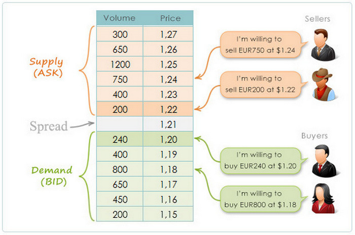
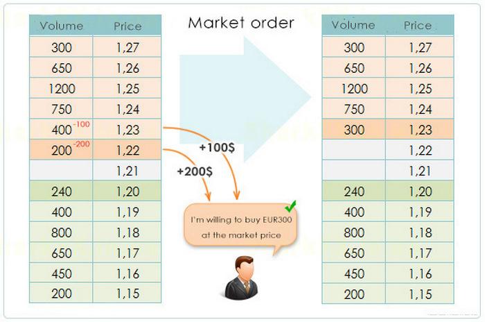

# Orderbook

This tutorial gives a brief description of stock trading and introduces some concepts and terms needed in this task. Most terms are highlighted
with _italic_ or **bold**.

## Exchanges and orderbook

Speaking informally, any exchange is a market place, where various *assets* (or instruments) are being traded. Such assets include
oil futures, companies' shares, currencies, cryptocurrencies and etc. In this task it doesn't matter, which asset we deal with, the important part is that it has some cost and can be bought or sold.

Lets consider EUR/USD currency pair. Assume we have some amount of USD, that we want to exchange for EUR. We can come to an exchange and say "I'd like to buy 240 eur for $1.2 per eur". This is called a **limit order**. The reason its called this way is because we explicitly set the price limit at which we are willing to buy this asset for. The amount of asset we want to buy or sell in an order is called **volume**. Its also possible to **cancel
order**.

Aside from orders to buy, there are also orders to sell. A set of limit buy/sell orders is called **orderbook**. Here is an example of orderbook including the order from the example above:

Orders to buy are called **bids**, whereas orders to sell are called **asks**. Memorize it with **b**uy = **b**id. As we'll see in a minute,
the inequality ask > bid is always true. The distance between the lowest ask price and the biggest bid price is called **spread**.

Now lets see how the actual trades are executed on exchanges. Consider another types of orders, so-called **market orders**.

Its possible to come to an exchange and say "I'd like to buy 300 eur at the best price". In this case the exchange takes limit orders to sell and starts **matching** them with this market order to buy. "Best price" for buyer means "as cheap as possible", so the matching is executed in asks' prices
ascending order. In this case we buy 200 eur for $1.22 first, and then another 100 for $1.23, since the volume in the order is 300.

So the market order is executed as well as limit orders it was matched with. The limit order with 1.22 price is executed fully, whereas the one with a price 1.23 is executed partially, so in the end there remains a limit order to sell 300 eur for $1.23 in the orderbook.

An executed limit order is usually called **filled**, and the result of successful matching is a **trade**. In this case 2 trades were made. Usually an exchange charges **fee** for any executed trade.

Market orders isn't the only way to make trades. Assume we place a limit order to buy 1000 eur for $1.23. Then the orderbook changes to this (*asks* are
denoted with italic and **bids** with bold):

*asks*  
...  
*750 1.24*  
**1000 1.23**  
*400 1.23*  
*200 1.22* 

SPREAD

**bids** 
**240 1.20** 
**400 1.19** 
...

Since there are limit orders to sell for the prices less, than the new order's price, matching starts again. And after executing all trades the orderbook now looks like this:

*asks*  
...  
*750 1.24* 

SPREAD

**bids**  
**400 1.23**  
**240 1.20**  
**400 1.19**  
...

When a limit order gets to the opposite side of an orderbook, its called **spread crossing**.

Given the algorithm of matching, its natural why ask > bid is always true and why bids are sorted in a price decreasing order, whereas asks are sorted
in a price increasing order.

## More details

From a technical point of view, the *correct* matching is the main responsibility of any exchange. *Correctness* here means:
1. In the right price order (increasing or decreasing depending on the orderbook's side)
2. In the right time order

So if 2 traders place their limit orders to the same price, the one that is placed first should be matched first.

Different exchanges provide different data detalization. Orderbook, in which the information about every order is known, is called **L3-orderbook**. Some exchanges only provide aggregated data, where multiple orders with the same price are collapsed into a single row and their volumes are summed. This is called **L2-orderbook**.

In this task you're given L2 orderbook data. So an update (17000, 2) means, that the current total volume of orders at the price 17000 is 2.
An update of form (17000, 0) means there are no more orders at this level anymore.
